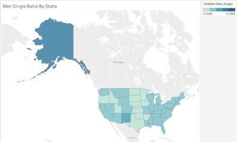
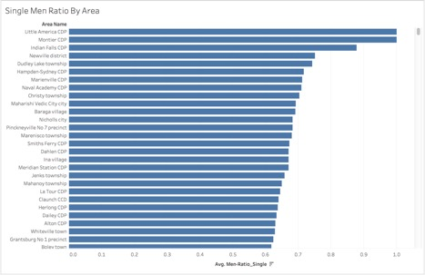
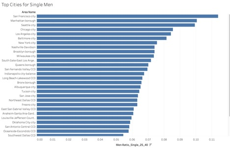
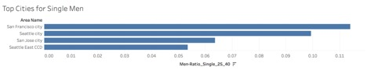
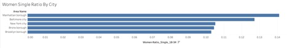

# Project - Best Cities for Dating

## Project Overview

A common problem amongst my friends is finding a significant other. I have girlfriend, so I am good, but I’m always willing to play cupid with my friends, male or female.

As a real-life example, I have a friend, that lives in Manhattan NY; For the analysis we’ll call her by the fake name Alexa (for privacy purposes). She complains that New York is the worst place in the world to date men because there are TOO MANY WOMEN. The competition makes dating hard. 

Then on the other hand I have a friend that lives in San Jose CA; We'll call him by the fake name Alex (again for privacy purposes). He complains that San Jose is the worst place in the world to date women, because the area seems over run with 'tech dudes'. The mass density nerds (because they're so sexy) doesn't leave many eligible bachelorettes.

## Analysis
The single life is hard, and I feel their pain, so let’s help out our friends Alexa and Alex find their one true love, using data! We’re going to maximize their chances for success by finding their optimal location to date. 

Let’s start with Alexa. To do this we'll use [Tableau](https://www.tableau.com/) to find the states that have the most men:

The chart is clear! Women should move to Alaska, where the ratio of single men is highest at 19.32%. With those odds, Alexa is practically guaranteed to find a husband! Oh, wait... Alexa is telling me that she’s not moving to Alaska just to find a husband. Apparently, it’s too cold and too far away from her family. So it’s back to the drawing board. The next best option is finding places in the continental US that have high single male ratios. I have an idea! 

Let’s plot a bar graph on [Tableau](https://www.tableau.com/) of single men by area in the continental US:

Fantastic news! Some areas have 90%+ single men; those are undeniable odds! I’m going to recommend Alexa move to Little America WY, a small town of 68 people in the middle of nowhere. Oh, wait... Alexa is telling me that she’s not moving to a small town in the middle of nowhere just to find a husband.

From talking a little more with Alexa, it sounds like she has certain criteria for her move to a new area. The first of which is the area needs to be a small city or larger. Which for our purposes we will consider 500,000+ people. Denver, where I currently live is around 650,000 people and is amazing! Also, from what Alexa tells me, it sounds like age range is important to her, she’ll only date men between the age of 25 to 40. 

So, let’s change our search criteria a little bit to weed out the single college people, and the single older adults. (Side note I have nothing against people aged 40+. Alexa is picky, and I think that’s part of her dating problem, but we'll save that for a different analysis). We’re going to need a new metric – percent men single between the ages of 25 and 40. I created this using [Tableau](https://www.tableau.com/)’s `Create Field` functionality. Now our target areas are cities, and we have a particular age range. 

Let’s replot: 

 
Great! So, the choice is clear San Francisco CA, Manhattan NY, and Seattle WA. These are the best places for single women to... Oh, wait. We’re back where we started. The whole reason we began this analysis was to find a place for Alexa to move to, and she already lives in Manhattan NY. This data is recommending she stay in the same location. After seeing this, it's clear we forgot to add a crucial data point, gender ratio. There have been excellent articles written about the importance of gender ratio and how it can cause dating imbalances for an entire areas dating scene. Human heterosexual marriage and coupling is (usually) 1 to 1. In areas where there are uneven gender ratios, say 54% to 46%, for every 100 people there are at least eight people left unpaired, which ends up driving a higher single percentage. 

So, to help Alexa out, let’s add a filter of male ratio that is 50% or greater: 

AND BOOM! The top three cities for single women to find a husband are San Francisco CA, Seattle WA, and San Jose CA. It looks like a move to the west coast is just what Alexa needs! 

Now, let’s go through the same process for Alex. As we just saw San Jose, CA is one of the best places to date... if you're a women looking for a husband. From talking to Alex, his dating age range is between 25 to 34, he also wants to move to a city, and to improve his odds let's look for a gender ratio of women 52%+. 

From plotting in [Tableau](https://www.tableau.com/), here are the results:

Outstanding! It appears Alex needs to move to Manhattan NY, Baltimore MD, or Brooklyn NY! It may be off to the east coast for Alex.

This will end the analysis for this project, as we've solved both Alex and Alexa's dating city dilemmas. Let's give a quick thanks to [Tableau](https://www.tableau.com/) for helping us easily find the best cities for our friends, thanks [Tableau](https://www.tableau.com/)!

## Resources

The data for this analysis was donated by the kind people at [TownCharts](http://www.towncharts.com/). They were nice enough to provide a csv file of population data that was already pre-cleaned which let us get right to the analysis. Thank you [TownCharts](http://www.towncharts.com/)!
